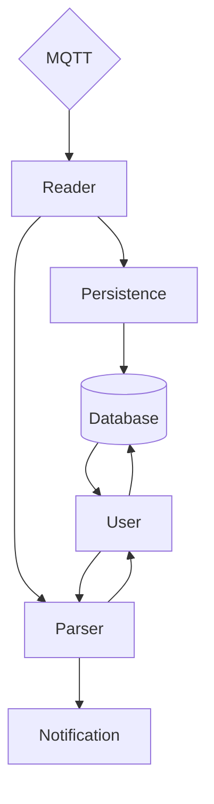

# Actor Discovery

## About

This is a simple [Actor model](https://en.wikipedia.org/wiki/Actor_model) project, using Rust and [Coerce](https://crates.io/crates/coerce). I've used it as a learning plateform.

## Architecture



_Each square nodes represent an unique actor_

## Standalone Project

### How to launch it

**Examples environnement variables:**

```env
# DB
POSTGRES_USER="postgres"                                # Database user connection
POSTGRES_PASSWORD="postgres"                            # Database password connection
POSTGRES_PORT=5432                                      # Database port
POSTGRES_HOST="localhost"                               # Database host
POSTGRES_DB="actor_discovery"                           # Database name

DATABASE_URL="postgresql://${POSTGRES_USER}:${POSTGRES_PASSWORD}@${POSTGRES_HOST}:${POSTGRES_PORT}/${POSTGRES_DB}"

# MQTT
MQTT_HOST="localhost"                                   # The MQTT host server
MQTT_PORT=1883                                          # The MQTT port server
```

**Run commands:**

```sh
# Setup .env
touch .env
$EDITOR .env # Use your favorite editor

# Debug | Run
cargo run

# Build
cargo build --release
```
